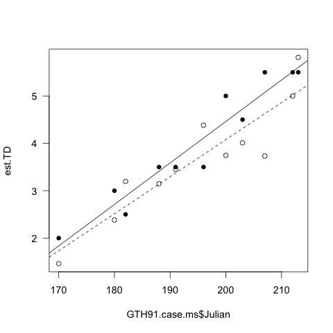
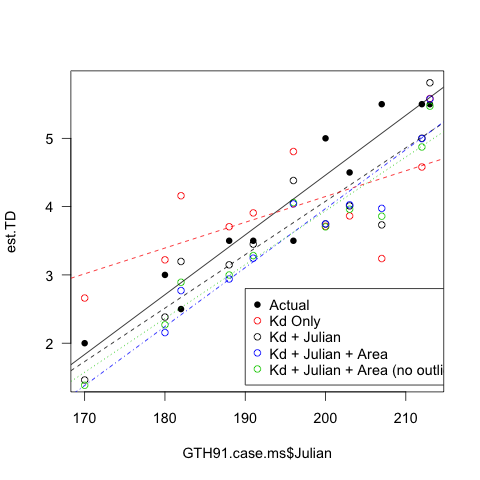

# Analysis of model predicting TD by Area, Kd, and Julian day
# Analysis of the collinearity of the predictors in the survey model used in the GTH 91 case study

These analyses are for the revisions to the boondoggle manuscript for Inland Waters and are based on the comment by Reviewer D:

> They state that thermocline depth in GTH 91 was predicted from the relationship between thermocline depth, Kd, surface area, and Julian day established in the surveys.  In the first section (Lake surveys) the authors note that Kd was significantly related to lake surface area and Julian day. Is there not an issue with collinearly if both Kd, surface area and Julian day are then used as independent variables in a regression? Indeed, there is no mention here that any of the assumptions of linear regression were assessed.

In "model_colinearity_analysis.R" I assess the collinearity of the predictors and determine that Kd and Area and Kd and Julian Day are slightly collinear (r^2^ = 0.1 and 0.2 resp.)

In this analysis I am assessing the effect of removing the correlated predictors from the model of GTH 91

## Predicting TD via Kd and Julian

### Load Data

    load("./data/boondoggle")

### Model of TD based on Kd and Julian Day

    summary(lm(TD ~ Kd + Julian, data = boon.tot))

#### Output

~~~~

> summary(lm(TD ~ Kd + Julian, data = boon.tot))

Call:
lm(formula = TD ~ Kd + Julian, data = boon.tot)

Residuals:
    Min      1Q  Median      3Q     Max 
-1.9244 -0.6356 -0.1058  0.5026  4.0368 

Coefficients:
            Estimate Std. Error t value Pr(>|t|)    
(Intercept) -2.18072    3.37406  -0.646  0.52159    
Kd          -4.58008    0.89308  -5.128 7.01e-06 ***
Julian       0.04947    0.01492   3.317  0.00189 ** 
---
Signif. codes:  0 ‘***’ 0.001 ‘**’ 0.01 ‘*’ 0.05 ‘.’ 0.1 ‘ ’ 1 

Residual standard error: 1.062 on 42 degrees of freedom
  (2 observations deleted due to missingness)
Multiple R-squared: 0.6253,	Adjusted R-squared: 0.6075 
F-statistic: 35.05 on 2 and 42 DF,  p-value: 1.115e-09

~~~~

## Using this model to predict TD in GTH 91 based on measurements of Kd and Julian day

    Use working dir =
    "/Volumes/NO NAME/working_files/current_research/boondoggle/inland_waters_submission/revisions/revision_analysis"

### Load Workspace GTH91.case.ms

    load("./data/GTH91.case.ms")

### Define the model:

Thermocline Depth = -2.18072 + Kd * -4.58008 + Julian Day * 0.04947

    est.TD <- -2.18072 + GTH91.case.ms$Kd * -4.58008 + GTH91.case.ms$Julian * 0.04947
est.TD

#### Output Estimated TD based on the model

    > est.TD
    [1] 1.461317 2.382422 3.147795 3.745557 3.732310 5.813988 3.196771 3.450095
    [9] 4.382167 4.010301 5.001018

### Regression of the estimated TD based on Kd + Julian by the Julian Day

    summary(lm(est.TD ~ GTH91.case.ms$Julian))

#### Output

~~~~

> summary(lm(est.TD ~ GTH91.case.ms$Julian))

Call:
lm(formula = est.TD ~ GTH91.case.ms$Julian)

Residuals:
    Min      1Q  Median      3Q     Max 
-0.8935 -0.2864 -0.0159  0.3012  0.7188 

Coefficients:
                      Estimate Std. Error t value Pr(>|t|)    
(Intercept)          -11.56633    2.23180  -5.183 0.000577 ***
GTH91.case.ms$Julian   0.07822    0.01143   6.841 7.55e-05 ***
---
Signif. codes:  0 ‘***’ 0.001 ‘**’ 0.01 ‘*’ 0.05 ‘.’ 0.1 ‘ ’ 1 

Residual standard error: 0.5024 on 9 degrees of freedom
Multiple R-squared: 0.8387,	Adjusted R-squared: 0.8208 
F-statistic:  46.8 on 1 and 9 DF,  p-value: 7.551e-05 

~~~~

### Regression of the actual TD by Julian Day in GTH91

    summary(lm(GTH91.case.ms$TD ~ GTH91.case.ms$Julian))

# Output

~~~~

> summary(lm(GTH91.case.ms$TD ~ GTH91.case.ms$Julian))

Call:
lm(formula = GTH91.case.ms$TD ~ GTH91.case.ms$Julian)

Residuals:
     Min       1Q   Median       3Q      Max 
-0.61144 -0.19899 -0.01234  0.22725  0.53834 

Coefficients:
                       Estimate Std. Error t value Pr(>|t|)    
(Intercept)          -13.049642   1.624174  -8.035 2.14e-05 ***
GTH91.case.ms$Julian   0.087557   0.008322  10.522 2.34e-06 ***
---
Signif. codes:  0 ‘***’ 0.001 ‘**’ 0.01 ‘*’ 0.05 ‘.’ 0.1 ‘ ’ 1 

Residual standard error: 0.3656 on 9 degrees of freedom
Multiple R-squared: 0.9248,	Adjusted R-squared: 0.9165 
F-statistic: 110.7 on 1 and 9 DF,  p-value: 2.34e-06

~~~~

### Plot of the estimated and actual TD by Julian Day

plot(est.TD ~ GTH91.case.ms$Julian)
points(TD ~ Julian, data = GTH91.case.ms, pch = 16)
abline(lm(GTH91.case.ms$TD ~ GTH91.case.ms$Julian), lty = 1)
abline(lm(est.TD ~ GTH91.case.ms$Julian), lty = 2)
dev.copy(png, "./output/Kd_Julian_TD_by_Julian.png")
dev.off()

### Estimation of TD with just Kd

Determine the relationship between Kd and TD

    summary(lm(TD ~ Kd, data = boon.tot))

#### Output

~~~~

> summary(lm(TD ~ Kd, data = boon.tot))

Call:
lm(formula = TD ~ Kd, data = boon.tot)

Residuals:
    Min      1Q  Median      3Q     Max 
-1.7236 -0.6497 -0.2573  0.6498  4.1443 

Coefficients:
            Estimate Std. Error t value Pr(>|t|)    
(Intercept)   8.9186     0.4775  18.677  < 2e-16 ***
Kd           -6.0109     0.8681  -6.924 1.66e-08 ***
---
Signif. codes:  0 ‘***’ 0.001 ‘**’ 0.01 ‘*’ 0.05 ‘.’ 0.1 ‘ ’ 1 

Residual standard error: 1.179 on 43 degrees of freedom
  (2 observations deleted due to missingness)
Multiple R-squared: 0.5272,	Adjusted R-squared: 0.5162 
F-statistic: 47.94 on 1 and 43 DF,  p-value: 1.658e-08 

~~~~

### Estimate TD using Kd alone based on above model

    Kd.est.TD <- 8.9186 + (GTH91.case.ms$Kd * -6.0109) 

#### Output

~~~~

 > Kd.est.TD
 [1] 2.661253 3.220868 3.705948 3.711357 3.239502 5.581949 4.159770 3.907914
 [9] 4.806543 3.864034 4.579932

~~~~

### Evaluation and Plot of the estimated TD using Kd only by Julian day in GTH 91

    summary(lm(Kd.est.TD ~ GTH91.case.ms$Julian))

#### Output

~~~~

> summary(lm(Kd.est.TD ~ GTH91.case.ms$Julian))

Call:
lm(formula = Kd.est.TD ~ GTH91.case.ms$Julian)

Residuals:
     Min       1Q   Median       3Q      Max 
-1.17262 -0.37590 -0.02087  0.39529  0.94342 

Coefficients:
                     Estimate Std. Error t value Pr(>|t|)  
(Intercept)          -3.39908    2.92901  -1.160   0.2757  
GTH91.case.ms$Julian  0.03774    0.01501   2.515   0.0331 *
---
Signif. codes:  0 ‘***’ 0.001 ‘**’ 0.01 ‘*’ 0.05 ‘.’ 0.1 ‘ ’ 1 

Residual standard error: 0.6593 on 9 degrees of freedom
Multiple R-squared: 0.4126,	Adjusted R-squared: 0.3474 
F-statistic: 6.323 on 1 and 9 DF,  p-value: 0.03306

~~~~

#### Plot of the estimated TD (with and w/o Julian in model) and actual TD by Julian day in GTH 91

    plot(est.TD ~ GTH91.case.ms$Julian)
    points(TD ~ Julian, data = GTH91.case.ms, pch = 16)
    points(Kd.est.TD ~ GTH91.case.ms$Julian, pch = 1, col = 2)
    abline(lm(GTH91.case.ms$TD ~ GTH91.case.ms$Julian), lty = 1)
    abline(lm(est.TD ~ GTH91.case.ms$Julian), lty = 2)
    abline(lm(Kd.est.TD ~ GTH91.case.ms$Julian), lty = 3, col = 2)
    abline(lm(pred.TD ~ Julian, data = GTH91.case.ms), lty = 4, col = 4)
    legend(170, 5.8, c("TD based on Kd and Julian", "Actual TD", "TD based on Kd", "TD based on Kd, Julian, Area"), lty = c(2, 1, 3, 4), col = c(1, 1, 2, 4))
    dev.copy(png, "./output/TD_models_by_Julian.png")
    dev.off()

### Estimation of TD using Kd, Julian Day and Area excluding Area outliers

    summary(lm(TD ~ Kd + Area + Julian, data = boon.tot, subset = Area != max(Area[Year == 2006]) & Area != max(Area[Year == 2008])))

#### Output

~~~~

> summary(lm(TD ~ Kd + Area + Julian, data = boon.tot, subset = Area != max(Area[Year == 2006]) & Area != max(Area[Year == 2008])))

Call:
lm(formula = TD ~ Kd + Area + Julian, data = boon.tot, subset = Area != 
    max(Area[Year == 2006]) & Area != max(Area[Year == 2008]))

Residuals:
     Min       1Q   Median       3Q      Max 
-2.45600 -0.48561 -0.02572  0.44333  1.97954 

Coefficients:
            Estimate Std. Error t value Pr(>|t|)    
(Intercept) -5.32643    3.01029  -1.769 0.084645 .  
Kd          -3.23420    0.78991  -4.094 0.000206 ***
Area         0.05274    0.01939   2.720 0.009692 ** 
Julian       0.05850    0.01274   4.590 4.52e-05 ***
---
Signif. codes:  0 ‘***’ 0.001 ‘**’ 0.01 ‘*’ 0.05 ‘.’ 0.1 ‘ ’ 1 

Residual standard error: 0.8032 on 39 degrees of freedom
  (2 observations deleted due to missingness)
Multiple R-squared: 0.7314,	Adjusted R-squared: 0.7107 
F-statistic: 35.39 on 3 and 39 DF,  p-value: 3.235e-11 

~~~~

### Estimation of TD from model with all parameters excluding Area outliers

    all.est.TD.noOut <- -5.32643 + GTH91.case.ms$Kd * -3.23420 + GTH91.case.ms$Area * 0.05274 + GTH91.case.ms$Julian * 0.05850

#### Output

    all.est.TD.noOut
    [1] 1.383618 2.269722 2.998722 3.703633 3.859248 5.470616 2.891904 3.282891
    [9] 4.058904 3.961281 4.872974

### Regression of TD estimated with all parameters minus Area outliers

    summary(lm(all.est.TD.noOut ~ GTH91.case.ms$Julian))

#### Output

~~~~

> summary(lm(all.est.TD.noOut ~ GTH91.case.ms$Julian))

Call:
lm(formula = all.est.TD.noOut ~ GTH91.case.ms$Julian)

Residuals:
     Min       1Q   Median       3Q      Max 
-0.63093 -0.20226 -0.01123  0.21269  0.50761 

Coefficients:
                       Estimate Std. Error t value Pr(>|t|)    
(Intercept)          -11.822180   1.575973  -7.502 3.69e-05 ***
GTH91.case.ms$Julian   0.078804   0.008075   9.759 4.38e-06 ***
---
Signif. codes:  0 ‘***’ 0.001 ‘**’ 0.01 ‘*’ 0.05 ‘.’ 0.1 ‘ ’ 1 

Residual standard error: 0.3547 on 9 degrees of freedom
Multiple R-squared: 0.9137,	Adjusted R-squared: 0.9041 
F-statistic: 95.25 on 1 and 9 DF,  p-value: 4.38e-06 

~~~~

### Plot of the estimated TD with all models and actual TD by Julian day in GTH 91

~~~~

plot(est.TD ~ GTH91.case.ms$Julian)
points(TD ~ Julian, data = GTH91.case.ms, pch = 16)
points(Kd.est.TD ~ GTH91.case.ms$Julian, pch = 1, col = 2)
points(all.est.TD.noOut ~ GTH91.case.ms$Julian, pch = 1, col = 3)
points(pred.TD ~ Julian, data = GTH91.case.ms, col = 4)
abline(lm(GTH91.case.ms$TD ~ GTH91.case.ms$Julian), lty = 1)
abline(lm(est.TD ~ GTH91.case.ms$Julian), lty = 2)
abline(lm(Kd.est.TD ~ GTH91.case.ms$Julian), lty = 2, col = 2)
abline(lm(pred.TD ~ Julian, data = GTH91.case.ms), lty = 4, col = 4)
abline(lm(all.est.TD.noOut ~ GTH91.case.ms$Julian), lty = 3, col = 3)
legend(190, 2.8, c("Actual", "Kd Only", "Kd + Julian", "Kd + Julian + Area", "Kd + Julian + Area (no outliers)"), pch = c(16, 1, 1, 1, 1), col = c(1, 2, 1, 4, 3))
dev.copy(png, "./output/All_TD_models_by_Julian.png")
dev.off()
~~~~

## Assessment of predicted vs observed fit

~~~~

plot(TD ~ pred.TD, data = GTH91.case.ms)

summary(lm(TD ~ pred.TD, data = GTH91.case.ms))

Call:
lm(formula = TD ~ pred.TD, data = GTH91.case.ms)

Residuals:
     Min       1Q   Median       3Q      Max 
-0.96830 -0.29892  0.04415  0.19612  1.09057 

Coefficients:
            Estimate Std. Error t value Pr(>|t|)    
(Intercept)   0.8625     0.6074    1.42 0.189351    
pred.TD       0.8925     0.1638    5.45 0.000406 ***
---
Signif. codes:  0 ‘***’ 0.001 ‘**’ 0.01 ‘*’ 0.05 ‘.’ 0.1 ‘ ’ 1 

Residual standard error: 0.6429 on 9 degrees of freedom
Multiple R-squared: 0.7675,	Adjusted R-squared: 0.7416 
F-statistic: 29.71 on 1 and 9 DF,  p-value: 0.0004055 

~~~~

## Conclusions

Despite the collinearity between Kd, Area, and Julian Day, the inclusion of all of them in the model is the best way to predict TD in GTH 91.

The slope of the actual relationship is 0.87

Using Kd alone provides a poor prediction of the TD in GTH 91

Using Kd + Julian Day does a decent job (R^2^ = 0.82) but underestimates the slope which is 0.78 and does not correct the bias in depth

Removing the large outlying lakes does not improve the slope fit slope = 0.78 and increases the depth bias

The whole model used in the original analysis does the best job of reproducing the slope in the original data.

There is further justification for using all of the predictor variables.  There is independent information that lake area and time since stratification will affect TD.
