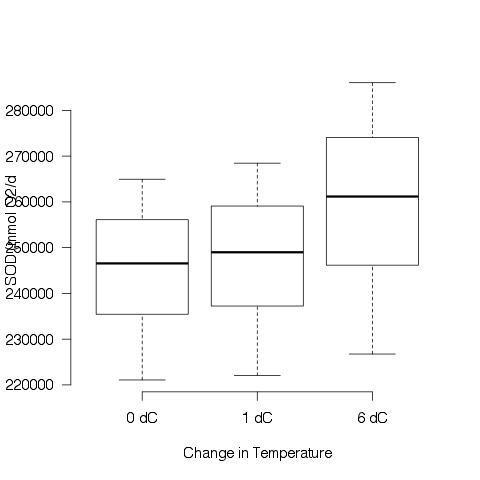
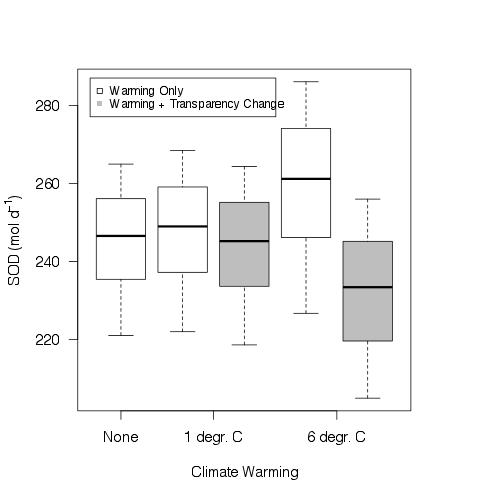

# Re-analysis of the case study results with the range of temperatures from Gudsaz et al 2010.

## Introduction

This analysis is in response to the comments by Reviewer D where they question the use of a single temperature and Kd value for the model.

> [ ]6.      Their future projections for climate change impacts are based on one Kd
value (which in turn was based on one study from literature) and one
possible future temperature increase based on one other study.  I suggest
they at least base these temperature estimates on climate change projections
for the region?  Or used a range of temperatures to capture the uncertainly
that is widely acknowledged for future climate projections?

I do not think that a more sophisticated climate analysis is warrented since the purpose of the model is to show the sensitivity of the system to **any** change in the temperature and Kd.  Furthermore, the range of temperatures indicated in Gudsaz et al 2010 are based on the best available global predictions from the IUCC.

Gudsaz et al 2010 indicate that the **most likely** warming scenario from the IUCC assessment is 1.8 - 4 deg C and the **likely** warming scenario is from 1.1 - 6.4 deg C. (This is based on: Solomon, S. et al. in Climate Change 2007: The Physical Science Basis. eds Solomon, S. et al. 1–18 Cambridge Univ. Press, 2007).

## Data Import

Use working directory:

    getwd()
    [1] "/Volumes/NO NAME/working_files/current_research/boondoggle/inland_waters_submission/revisions/revision_analysis"

### Load workspace

    # load boondoggle workspace with environmental data on GTH 91
    load("./data/boondoggle")

    # load GTH 91 case study workspace with data on the case study model
    load("./data/GTH91.case.ms")

Use the `boon.tot` data.frame for the environmental data

Use the `GTH91.case.ms` data.frame for the model data

##Calculate the percent area of sediments in the epiliminion of lake GTH 91

### Generate the constants needed for the calculations

    z.max <- 10
    GTH91.alpha <- 0.5 

#### Variable descriptions

* z.max is the maximum depth of lake GTH 91 (m)

* GTH91.alpha is the non-dimensional constant that was calculated from the hyposgraphic curve in in the GTH91.bathy data.frame. See "boondoggle_data_analysis.pdf" for origin of value
 
### Perform calculation of the sediment area of the mixed layer in lake GTH91 using the measured TD

     mix.A <- GTH91.case.ms$Area - (GTH91.case.ms$Area * (1 - (GTH91.case.ms$TD / z.max))^GTH91.alpha)

#### Output

The sediment area above the thermocline (ha) in lake GTH 91 using the observed TD 

~~~~

> mix.A
 [1] 0.2639320 0.4083499 0.4844356 0.7322330 0.8229490 0.8229490 0.3349365
 [8] 0.4844356 0.4844356 0.6459504 0.8229490

~~~~

This calculation reproduced the values in the current manuscript (GTH91.case.ms$Mix.Area)

### Perform calculation of sediment area of the mixed layer in lake GTH 91 using the predicted TD based on the linear model of Kd, Area, and Julian day from my dissertation

Model parameters came from table 6. Also from p 64, table 17 of my dissertation

     pred.mix.A <- GTH91.case.ms$Area - (GTH91.case.ms$Area * (1 - (-3.08 * GTH91.case.ms$Kd + 0.04 * GTH91.case.ms$Area + 0.067 * GTH91.case.ms$Julian -7.08)/z.max)^GTH91.alpha)

#### Output

The sediment area above the thermocline (ha) in lake GTH 91 using the observed TD 

~~~~

> pred.mix.A
 [1] 0.1552879 0.2864717 0.4001524 0.5238605 0.5601250 0.8381659 0.3750829
 [8] 0.4459662 0.5707793 0.5685219 0.7323844

~~~~

This analysis very closely reproduces the values in the manuscript in GTH91.case.ms$pred.Mix.Area but there are some slight discrepancies that I suspect are due to rounding errors somewhere.

The values in GTH91.case.ms$pred.Mix.Area are:

~~~~

> GTH91.case.ms$pred.Mix.Area
 [1] 0.1546216 0.2857659 0.3994084 0.5230699 0.5593197 0.8372260 0.3743477
 [8] 0.4452056 0.5699696 0.5677131 0.7315006

~~~~

## Calculate the change in Kd in lake GTH 91 based on the likely temperature increase of 1.1 - 6.4 deg C

Keller et al. 2008 estimate a 0.5 to 2.3 mg/L increase in DOC per deg C warming.

I cannot find the original DOC measurement that I used for the calculations in the manuscript but SCW reports a 458 umol/L DOC in GTH 91 in early July (SCW unpublished data)

### Conversiton of SCW DOC value to mg/L

    GTH91.DOCumolL.Jul2009 <- 458 # the DOC concentration of GTH 91 in early July 2009 in umol/L (SCW unpub. data)
    ug.umol.C <- 12 # micrograms per umol of carbon

    # confirm unit conversion
    umol    ug      ug
    ---- * ----  = ----
     L     umol     L

    # convert to ug/L
    GTH91.DOCugL.Jul2009 <- GTH91.DOCumolL.Jul2009 * ug.umol.C # the DOC conc. in ug/L

    # convert to mg/L
    GTH91.DOCmgL.Jul2009 <- GTH91.DOCugL.Jul2009 / 1000
    GTH91.DOCmgL.Jul2009

#### Output

    [1] 5.496 # DOC conc. of GTH 91 in early Jul 2009 (mg/L)

### Generate the range of SOD increases and DOC values for a 1.1 to 6.4 deg C temp. increase based on Keller et al 2008 formula

To make a vector of the DOC values that would result from a 1.1 to 6.4 deg C increase in temperature I am applying the relationship identified by Keller et al 2008, which is a 0.5 to 2.3 mg/L increase in DOC per 1 deg C increase in temp.

#### Calculations

    temp.incr <- 1:7
    keller.low <- 0.5
    keller.high <- 2.3

To generate a vector of DOC concentrations I add the current DOC in GTH 91 to the temperature increase multiplied by the Keller high and low factor increase

    DOC.low <- GTH91.DOCmgL.Jul2009 + (temp.incr * keller.low)
    DOC.high <- GTH91.DOCmgL.Jul2009 + (temp.incr * keller.high)

##### Output

    > DOC.low
    [1] 5.996 6.496 6.996 7.496 7.996 8.496 8.996

    > DOC.high
    [1] 7.796 10.096 12.396 14.696 16.996 19.296 21.596

To calculate the change in epi SOD for the temperature alone, I use the slope of the temp effect from the temperature experiment to "adjust" the estimated current temp.

    temp.slope <- 0.61
    current.epi.area <- 4945
    current.epi.SOD <- 18.6
    temp.SOD.areal.incr <- current.epi.SOD + (temp.incr * temp.slope)
    temp.SOD.incr <- temp.SOD.areal.incr * current.epi.area

##### Output

    temp.SOD.areal.incr
    [1] 19.21 19.82 20.43 21.04 21.65 22.26 22.87

    temp.SOD.incr
    [1]  94993.45  98009.90 101026.35 104042.80 107059.25 110075.70 113092.15

### Generate Kd values for DOC values from the increase in temp

To etimate the Kd value of the lake at different DOC concentrations I used the relationship between Kd and DOC in the 2008 survey

    summary(lm(Kd ~ DOC, data = boon.tot, subset = Year == 2008))

#### Output of the regression of Kd by DOC

~~~~

Call:
lm(formula = Kd ~ DOC, data = boon.tot, subset = Year == 2008)

Residuals:
     Min       1Q   Median       3Q      Max 
-0.22323 -0.06648  0.01152  0.06280  0.16841 

Coefficients:
            Estimate Std. Error t value Pr(>|t|)    
(Intercept)  0.21644    0.08880   2.437 0.027715 *  
DOC          0.15032    0.03012   4.991 0.000161 ***
---
Signif. codes:  0 ‘***’ 0.001 ‘**’ 0.01 ‘*’ 0.05 ‘.’ 0.1 ‘ ’ 1 

Residual standard error: 0.1156 on 15 degrees of freedom
Multiple R-squared: 0.6241,	Adjusted R-squared: 0.5991 
F-statistic: 24.91 on 1 and 15 DF,  p-value: 0.0001613 

~~~~

#### Predict the Kd from the DOC estimates following high and low warming conditions

    Kd.DOC.intercept <- 0.21644
    Kd.DOC.slope <- 0.15032
    Kd.current <- Kd.DOC.intercept + GTH91.DOCmgL.Jul2009 * Kd.DOC.slope
    Kd.high <- Kd.DOC.intercept + DOC.high * Kd.DOC.slope
    Kd.low <- Kd.DOC.intercept + DOC.low * Kd.DOC.slope

##### Output of predicted Kd values for DOC increase from 1 - 7 deg warming in lake GTH 91
    
~~~~
> Kd.current
[1] 1.042599

> Kd.high
    [1] 1.388335 1.734071 2.079807 2.425543 2.771279 3.117015 3.462751

> Kd.low
    [1] 1.117759 1.192919 1.268079 1.343239 1.418399 1.493559 1.568719

~~~~

### Generate the sediment area above the thermocline using the estimated Kd values

Using the mixed area formula from above:

~~~~

# the sediment area above the thermocline using the median of the observed Kd  
obs.mix.A <- GTH91.case.ms$Area - (GTH91.case.ms$Area * (1 - (-3.08 * Kd.current + 0.04 * GTH91.case.ms$Area + 0.067 * GTH91.case.ms$Julian -7.08)/z.max)^GTH91.alpha)

# using the low est for 1 - 7 d warming
low1.mix.A <- GTH91.case.ms$Area - (GTH91.case.ms$Area * (1 - (-3.08 * Kd.low[1] + 0.04 * GTH91.case.ms$Area + 0.067 * GTH91.case.ms$Julian -7.08)/z.max)^GTH91.alpha)
low2.mix.A <- GTH91.case.ms$Area - (GTH91.case.ms$Area * (1 - (-3.08 * Kd.low[2] + 0.04 * GTH91.case.ms$Area + 0.067 * GTH91.case.ms$Julian -7.08)/z.max)^GTH91.alpha)
low3.mix.A <- GTH91.case.ms$Area - (GTH91.case.ms$Area * (1 - (-3.08 * Kd.low[3] + 0.04 * GTH91.case.ms$Area + 0.067 * GTH91.case.ms$Julian -7.08)/z.max)^GTH91.alpha)
low4.mix.A <- GTH91.case.ms$Area - (GTH91.case.ms$Area * (1 - (-3.08 * Kd.low[4] + 0.04 * GTH91.case.ms$Area + 0.067 * GTH91.case.ms$Julian -7.08)/z.max)^GTH91.alpha)
low5.mix.A <- GTH91.case.ms$Area - (GTH91.case.ms$Area * (1 - (-3.08 * Kd.low[5] + 0.04 * GTH91.case.ms$Area + 0.067 * GTH91.case.ms$Julian -7.08)/z.max)^GTH91.alpha)
low6.mix.A <- GTH91.case.ms$Area - (GTH91.case.ms$Area * (1 - (-3.08 * Kd.low[6] + 0.04 * GTH91.case.ms$Area + 0.067 * GTH91.case.ms$Julian -7.08)/z.max)^GTH91.alpha)
low7.mix.A <- GTH91.case.ms$Area - (GTH91.case.ms$Area * (1 - (-3.08 * Kd.low[7] + 0.04 * GTH91.case.ms$Area + 0.067 * GTH91.case.ms$Julian -7.08)/z.max)^GTH91.alpha)

# using the high estimate for 1 - 7 degr warming
high1.mix.A <- GTH91.case.ms$Area - (GTH91.case.ms$Area * (1 - (-3.08 * Kd.high[1] + 0.04 * GTH91.case.ms$Area + 0.067 * GTH91.case.ms$Julian -7.08)/z.max)^GTH91.alpha)
high2.mix.A <- GTH91.case.ms$Area - (GTH91.case.ms$Area * (1 - (-3.08 * Kd.high[2] + 0.04 * GTH91.case.ms$Area + 0.067 * GTH91.case.ms$Julian -7.08)/z.max)^GTH91.alpha)
high3.mix.A <- GTH91.case.ms$Area - (GTH91.case.ms$Area * (1 - (-3.08 * Kd.high[3] + 0.04 * GTH91.case.ms$Area + 0.067 * GTH91.case.ms$Julian -7.08)/z.max)^GTH91.alpha)
high4.mix.A <- GTH91.case.ms$Area - (GTH91.case.ms$Area * (1 - (-3.08 * Kd.high[4] + 0.04 * GTH91.case.ms$Area + 0.067 * GTH91.case.ms$Julian -7.08)/z.max)^GTH91.alpha)
high5.mix.A <- GTH91.case.ms$Area - (GTH91.case.ms$Area * (1 - (-3.08 * Kd.high[5] + 0.04 * GTH91.case.ms$Area + 0.067 * GTH91.case.ms$Julian -7.08)/z.max)^GTH91.alpha)
high6.mix.A <- GTH91.case.ms$Area - (GTH91.case.ms$Area * (1 - (-3.08 * Kd.high[6] + 0.04 * GTH91.case.ms$Area + 0.067 * GTH91.case.ms$Julian -7.08)/z.max)^GTH91.alpha)
high7.mix.A <- GTH91.case.ms$Area - (GTH91.case.ms$Area * (1 - (-3.08 * Kd.high[7] + 0.04 * GTH91.case.ms$Area + 0.067 * GTH91.case.ms$Julian -7.08)/z.max)^GTH91.alpha)

# plot of the changes in area
par(las =1)
plot(obs.mix.A ~ GTH91.case.ms$Julian, ylim = c(-1, 1), ylab = "Proportion Sed Area Above Thermocline", xlab = "Julian Day", col = 4)
points(low1.mix.A ~ GTH91.case.ms$Julian)
points(low2.mix.A ~ GTH91.case.ms$Julian)
points(low3.mix.A ~ GTH91.case.ms$Julian)
points(low4.mix.A ~ GTH91.case.ms$Julian)
points(low5.mix.A ~ GTH91.case.ms$Julian)
points(low6.mix.A ~ GTH91.case.ms$Julian)
points(low7.mix.A ~ GTH91.case.ms$Julian)
points(high1.mix.A ~ GTH91.case.ms$Julian, pch = 16)
points(high2.mix.A ~ GTH91.case.ms$Julian, pch = 16)
points(high3.mix.A ~ GTH91.case.ms$Julian, pch = 16)
points(high4.mix.A ~ GTH91.case.ms$Julian, pch = 16)
points(high5.mix.A ~ GTH91.case.ms$Julian, pch = 16)
points(high6.mix.A ~ GTH91.case.ms$Julian, pch = 16)
points(high7.mix.A ~ GTH91.case.ms$Julian, pch = 16)
abline(h = 0)
legend(170, 1, c("Current Est. Kd", "0.5 mg/L DOC inc. per deg. C", "2.3 mg/L DOC inc. per deg. C"), pch = c(1, 1, 16), col = c(4, 1, 1))

~~~~

#### Output

The range in of sediment areas (ha) above the thermocline in GTH 91 under current conditions, 1 dC warming, and 6 dC warming.

~~~~

> obs.mix.A
 [1] 0.1546317 0.2456703 0.3212383 0.4397809 0.5121928 0.5764284 0.2643228
 [8] 0.3502611 0.3995233 0.4704982 0.5655744

> low1.mix.A
 [1] 0.1239875 0.2138054 0.2882845 0.4049617 0.4761273 0.5391812 0.2321959
 [8] 0.3168691 0.3653606 0.4351609 0.5285321

> low6.mix.A
 [1] -0.02365817  0.06071721  0.13037966  0.23889396  0.30466961  0.36265924
 [7]  0.07794498  0.15703702  0.20215307  0.26684628  0.35288553

~~~~

## Calculate the change in whole-lake SOD with just the change in temperature

The `temp.SOD.areal.incr` vector represents the change in epilimnetic SOD across a 1 - 7 d C temperature increase.

The first item in this vector `temp.SOD.areal.incr[1]` represents the areal SOD for 1 d C increase, which equals 91.21 mmol O2/m2/d and `temp.SOD.areal.incr[6]` represents the areal SOD for a 6 d C increase in temp, which equals 22.87 mmol O2/m2/d.

Multiplying these extremes by `obs.mix.A * 10000`, which is the mixed area (converted from ha to m^2) under the current conditions, estimated from the median Kd provides a vector of the range of epilimnetic SOD across the season.
  
    epi.SOD.temp0 <- current.epi.SOD * (obs.mix.A * 10000) # using the est current areal SOD
    epi.SOD.temp1 <- temp.SOD.areal.incr[1] * (obs.mix.A * 10000) # using 1 d C temp increase
    epi.SOD.temp6 <- temp.SOD.areal.incr[6] * (obs.mix.A * 10000) # using 6 d C temp increase

#### Output

SOD estimates in mmol O2/d

~~~~

> epi.SOD.temp0
 [1]  28761.49  45694.67  59750.32  81799.26  95267.86 107215.69  49164.04
 [8]  65148.56  74311.33  87512.67 105196.83

> epi.SOD.temp1
 [1]  29704.75  47193.26  61709.88  84481.92  98392.23 110731.90  50776.41
 [8]  67285.15  76748.42  90382.71 108646.84

> epi.SOD.temp6
 [1]  34421.01  54686.20  71507.65  97895.24 114014.11 128312.97  58838.26
 [8]  77968.11  88933.88 104732.90 125896.85

~~~~

### Convert epiliminion SOD to whole-lake measurements

In order to convert the epilimnion measurements to whole-lake measurements I subtract the estimated sediment area above the thermocline from the total sediment area (ha) `GTH91.case.ms$Area` = 2.5 ha.

    obs.hypo.A <- GTH91.case.ms$Area - obs.mix.A

To calculate the whole-lake SOD, I add the epilimnetic SOD estimate (`epi.SOD.temp(0, 1, 6)`) to the areal hypolimnetic SOD estimate from the manuscript (8.2 mmol O2/m2/d) by the hypolimnion sediment area (`obs.hypo.A`)

This assumes that the temperature changes do not alter the conditions of the hypolimnion.

    hypo.SOD.areal <- 8.2 # mmol O2/m2/d
    hypo.SOD <- hypo.SOD.areal * (obs.hypo.A * 10000) # mmol O2/d

    wholeLake.SOD.temp0 <- epi.SOD.temp0 + hypo.SOD
    wholeLake.SOD.temp1 <- epi.SOD.temp1 + hypo.SOD
    wholeLake.SOD.temp6 <- epi.SOD.temp6 + hypo.SOD

#### Output

SOD estimates in mmol O2/d

~~~~

> wholeLake.SOD.temp0
 [1] 221081.7 230549.7 238408.8 250737.2 258268.0 264948.6 232489.6 241427.1
 [9] 246550.4 253931.8 263819.7

> wholeLake.SOD.temp1
 [1] 222024.9 232048.3 240368.3 253419.9 261392.4 268464.8 234101.9 243563.7
 [9] 248987.5 256801.9 267269.7

> wholeLake.SOD.temp6
 [1] 226741.2 239541.2 250166.1 266833.2 277014.3 286045.8 242163.8 254246.7
 [9] 261173.0 271152.0 284519.8

~~~~

##### Figure; Plot of the change in whole-lake SOD (mmol O2/d) in lake GTH 91 following a 0, 1, or 6 degree increase in temperature without a change in transparency/thermocline depth.

    boxplot(wholeLake.SOD.temp0, wholeLake.SOD.temp1, wholeLake.SOD.temp6, axes = F, ylab ="SOD (mmol O2/d", xlab = "Change in Temperature")
    axis(2)
    axis(1, c("0 dC", "1 dC", "6 dC"), at = c(1, 2, 3))
    dev.copy(jpeg, "./output/whole_lake_SOD_temp.jpg")
    dev.off()

    
## Calculate the change in whole lake SOD with warming and change in Kd

This analysis uses the Kd values calculated from the low estimate of Keller et al. 2008 of 0.5 mg/L DOC increase with a 1 d C increase in temperature.

To calculate the change in whole lake SOD with warming and a change in transparency/ thermocline depth I use the estimated sediment areas calculated at the different temperatures.

For the 1 degree increase in temperature the mixed sediment areas (ha) are in `low1.mix.A`, thus the SOD above the thermocline for the 1 degree temp increase, including the change in thermocline depth would be:

    epi.SOD.tempTrans1 <- temp.SOD.areal.incr[1] * (low1.mix.A * 10000)

The earliest day (Julian day 170) value of the epilimnetic area is negative (see `low6.mix.A` above).  Obviously this cannot be true and the lowest the epi area can fall is 0, so the negative number is replaced with a 0 using `(c(0, low6.mix.A[-1])`

The SOD above the thermocline for the 6 degree temp. increase, including the change in thermocline depth would be:

    epi.SOD.tempTrans6 <- temp.SOD.areal.incr[6] * (c(0, low6.mix.A[-1]) * 10000) # changes neg area to 0

#### Output

~~~~

> epi.SOD.tempTrans1
 [1]  23817.99  41072.03  55379.45  77793.14  91464.06 103576.70  44604.83
 [8]  60870.55  70185.76  83594.41 101531.02

> epi.SOD.tempTrans6
 [1]     0.00 13515.65 29022.51 53177.79 67819.45 80727.95 17350.55 34956.44
 [9] 44999.27 59399.98 78552.32

~~~~

### Calculate the change in whole-lake SOD with warming and change in transparency/thermocline depth

Assuming that the warming of the epilimnion does not change the conditions of the hypolimnion I calculated the change in hypolimnion SOD as the areal hypolimnion SOD * sediment area below the thermocline

The sediment area below the thermocline for 1 and 6 degr C change in temperature with warming and TD change is calculated as the difference between the total lake sediment area (m2) `GTH91.case.ms$Area * 10000` and the estimated epilimnetic sediment area `low1.mix.A` and `low6.mix.A`

The negative epi area is changed to 0 as above.

    hypo.SOD.tempTrans1 <- hypo.SOD.areal * ((GTH91.case.ms$Area * 10000) - low1.mix.A * 10000)
    hypo.SOD.tempTrans6 <- hypo.SOD.areal * ((GTH91.case.ms$Area * 10000) - c(0, low6.mix.A[-1]) * 10000) # changed neg area to 0

#### Output

~~~~

> hypo.SOD.tempTrans1
 [1] 194833.0 187468.0 181360.7 171793.1 165957.6 160787.1 185959.9 179016.7
 [9] 175040.4 169316.8 161660.4

> hypo.SOD.tempTrans6
 [1] 205000.0 200021.2 194308.9 185410.7 180017.1 175261.9 198608.5 192123.0
 [9] 188423.4 183118.6 176063.4

~~~~

Calculate the whole-lake SOD as the sum of the epi and hypo SOD

    wholeLake.SOD.tempTrans1 <- epi.SOD.tempTrans1 + hypo.SOD.tempTrans1
    wholeLake.SOD.tempTrans6 <- epi.SOD.tempTrans6 + hypo.SOD.tempTrans6

#### Output

~~~~

> wholeLake.SOD.tempTrans1
 [1] 218651.0 228540.0 236740.1 249586.3 257421.6 264363.8 230564.8 239887.3
 [9] 245226.2 252911.2 263191.4

> wholeLake.SOD.tempTrans6
 [1] 205000.0 213536.8 223331.4 238588.5 247836.5 255989.9 215959.1 227079.4
 [9] 233422.7 242518.6 254615.7

~~~~

##### Figure; Plot of the change in whole-lake SOD (mmol O2/d) in lake GTH 91 following a 0, 1, or 6 degree increase in temperature with and without a change in transparency/thermocline depth.

    par(las = 1, mar=c(4, 4.5, 4, 4))
    boxplot(wholeLake.SOD.temp0/1000, wholeLake.SOD.temp1/1000, wholeLake.SOD.tempTrans1/1000, wholeLake.SOD.temp6/1000,  wholeLake.SOD.tempTrans6/1000, col = c(0, 0, 8, 0, 8), axes = F, ylab = expression(paste("SOD (mol d"^{-1},")")), xlab = "Climate Warming")
    axis(2)
    axis(1, c("None", "1 degr. C", "6 degr. C"), at = c(1, 2.5, 4.5))
    legend(0.5, 287, c("Warming Only", "Warming + Transparency Change"), pch = c(0, 15), col = c(1, 8), cex = 0.8)
    box()
    dev.copy(jpeg, "./output/whole_lake_SOD_temp_trans.jpg")
    dev.off()
    dev.copy(pdf, "./output/whole_lake_SOD_temp_trans.pdf")
    dev.off()

### Summary of results

#### Calculation of percent change in SOD

With Warming increase only

    perc.change.temp1 <- ((median(wholeLake.SOD.temp1) - median(wholeLake.SOD.temp0)) / median(wholeLake.SOD.temp0)) * 100
    perc.change.temp6 <- ((median(wholeLake.SOD.temp6) - median(wholeLake.SOD.temp0)) / median(wholeLake.SOD.temp0)) * 100

With Warming and trans change

    perc.change.tempTrans1 <- ((median(wholeLake.SOD.tempTrans1) - median(wholeLake.SOD.temp0)) / median(wholeLake.SOD.temp0)) * 100
    perc.change.tempTrans6 <- ((median(wholeLake.SOD.tempTrans6) - median(wholeLake.SOD.temp0)) / median(wholeLake.SOD.temp0)) * 100

##### Output

##### 1 degree increase warming only

~~~~
>     median(wholeLake.SOD.temp0)
[1] 246550.4

>     median(wholeLake.SOD.temp1)
[1] 248987.5

>     perc.change.temp1
[1] 0.9884761

~~~~

##### 6 degree increase warming only

~~~~

>     median(wholeLake.SOD.temp6)
[1] 261173

>     perc.change.temp6
[1] 5.930856
    
~~~~

##### 1 degree increase warming and trans change

~~~~

>     median(wholeLake.SOD.tempTrans1)
[1] 245226.2

>     perc.change.tempTrans1
[1] -0.5370996

~~~~
    
##### 6 degree increase warming and trans change

~~~~

>     median(wholeLake.SOD.tempTrans6)
[1] 233422.7

>     perc.change.tempTrans6
[1] -5.324549

~~~~
       
## Variables

* temp.incr = a vetor of temperature increases in 1 deg C incremnets that approxomates the range of 'likely' temperature increases from Gudsaz et al 2010 which report a range of increases from 1.1 to 6.4

* keller.low = the low estimate of the DOC increase (mg/L) per 1 deg C increase in temp from Keller et al 2008
 
* keller.high = the high estimate of the DOC increase (mg/L) per 1 deg C increase in temp from Keller et al 2008

* DOC.low = the vector of GTH 91 DOC concentration (mg/L) following a 1 to 7 deg C temp increase based on the Keller et al 2008 low estimate

* DOC.low = the vector of GTH 91 DOC concentration (mg/L) following a 1 to 7 deg C temp increase based on the Keller et al 2008 high estimate

* temp.slope = the change in areal SOD (mmol O2/m2/d) per change in deg C

* current.epi.area = the median sediment area above the thermocline (m2) taken from the manuscript

* current.epi.SOD = the median of the SOD from the 12 deg temp exp treatment (mmol O2/m2/d)

* temp.SOD.areal.incr = a vector of the predicted areal SOD (mmol O2/m2/d) for the epilimnion over the 1 - 7 deg C range of temp increases

* temp.SOD,incr = a vector of the epi SOD (mmol O2/d) for the whole epilimnion

* Kd.DOC.intercept = the intercept of the Kd by DOC linerar model for the 2008 survey

* Kd.DOC.slope = the intercept of the Kd by DOC linear model for the 2008 survey

* GTH91.DOCmgL.Jul2009 = the DOC concentration of Lake GTH 91 in early July 2009 (mg L^-1), SCW unpub data.

* Kd.current = the estimated Kd value of Lake GTH 91 using the `GTH91.DOCmgL.Jul2009` DOC value (m^-1).

* Kd.high = a vector of the estimated Kd values in GTH 91 across a 1 -7 degr warming for the increase in DOC from the high Keller et al 2008 estimate (m^-1)

* Kd.low = a vector of the estimated Kd values in GTH 91 across a 1 -7 degr warming for the increase in DOC from the low Keller et al 2008 estimate (m^-1)

* obs.mix.A = the area of sediment above the thermocline (ha) estimated using the median Kd value observed in the GTH 91 surveys

* low(N).mix.A = the area of sediment above the thermocline (ha) using the Kd value predicted from the low estimated relationship between DOC concentration and temperature from Keller et al. 2008 = 0.5 mg/L incr. per 1 d C incr in temp.  N = the temp increase

* high(N).mix.A = the area of sediment above the thermocline (ha) using the Kd value predicted from the high estimated relationship between DOC concentration and temperature from Keller et al. 2008 = 2.3 mg/L incr. per 1 d C incr in temp.  N = the temp increase

* epi.SOD.temp(0, 1, 6) = the SOD of the sediments above the thermocline in GTH 91 based on a 0, 1, or 6 d C increase in temp. (mmol O2/d)

* obs.hypo.A = the area of the sediments below the thermocline (ha) in lake GTH 91 during the modeled period 

* hypo.SOD.areal = the areal SOD of the sediments below the thermocline in lake GTH 91 (mmol O2/m2/d) taken from the manuscript calculations

* hypo.SOD = the SOD of the sediments below the thermocline of GTH 91 (mmol O2/d) based on the changes in the hypolimnetic sediment area during the modeled period.  This assumes no effect of epilimnetic warming on hypo SOD.

* wholeLake.SOD.temp(0, 1, 6) = the sum of the SOD above and below the thermocline for lake GTH 91 during the modelled period (mmol O2/d). The range od numbers represents 0, 1 or 6 d C warming.

* epi.SOD.tempTrans(1, 6) = the SOD of the epilimnion of GTH 91 (mmol O2/d) including a 1 or 6 degr. increase in temperature and the appropriate change in transparency.  The value is calculated as the areal SOD rate multiplied by the epilimnetic sediment area.

* hypo.SOD.tempTrans(1, 6) = the SOD of the hypolimnion of GTH 91 (mmol O2/d) including a 1 or 6 degr. increase in temperature and the appropriate change in transparency.  The value is calculated as the areal SOD rate multiplied by the epilimnetic sediment area minus the total lake area.

* wholeLake.SOD.tempTrans(1, 6) = the sum of the epi and hypolimnetic SOD (mmol O2/d) including a 1 or 6 degr. increase in temperature and the appropriate change in transparency.   
