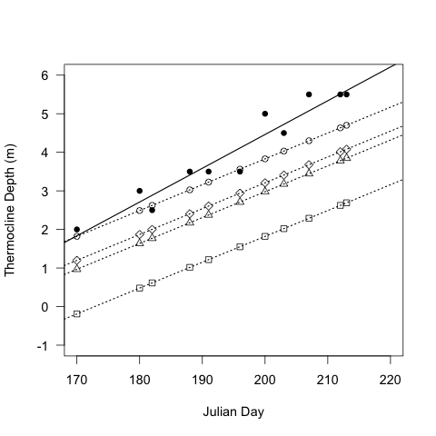

# Comparison of TD predicted from median Kd, estimated Kd from DOC and with warming

## Introduction

This code is modified from the code used to draw figure 8 in the original boondoggle ms with the model.  These analysis is to compare the predicted TD using various constant Kd values to the observed values.

### Load data

    load("./data/boondoggle")
    load("./data/GTH91.case.ms")

### Re-Create model parameters

    summary(lm(TD ~ Kd + Julian + Area, data = boon.tot))

#### Output

~~~~

>     summary(lm(TD ~ Kd + Julian + Area, data = boon.tot))

Call:
lm(formula = TD ~ Kd + Julian + Area, data = boon.tot)

Residuals:
     Min       1Q   Median       3Q      Max 
-2.39035 -0.59246  0.00431  0.46310  2.03108 

Coefficients:
             Estimate Std. Error t value Pr(>|t|)    
(Intercept) -7.081766   3.219839  -2.199 0.033544 *  
Kd          -3.084772   0.874888  -3.526 0.001054 ** 
Julian       0.067080   0.013833   4.849 1.82e-05 ***
Area         0.037501   0.009969   3.762 0.000529 ***
---
Signif. codes:  0 ‘***’ 0.001 ‘**’ 0.01 ‘*’ 0.05 ‘.’ 0.1 ‘ ’ 1 

Residual standard error: 0.9267 on 41 degrees of freedom
  (2 observations deleted due to missingness)
Multiple R-squared: 0.7214,	Adjusted R-squared: 0.7011 
F-statistic:  35.4 on 3 and 41 DF,  p-value: 1.862e-11

~~~~

### Generate predicted TD from Kd and from median Kd

    predTD.medianKd <- (median(GTH91.case.ms$Kd) * -3.08) + (GTH91.case.ms$Julian * 0.067) + (GTH91.case.ms$Area * 0.04) - 7.08

#### Output

    > predTD.medianKd
    [1] 1.820028 2.490028 3.026028 3.830028 4.299028 4.701028 2.624028 3.227028
    [9] 3.562028 4.031028 4.634028

### Plot of TD, predicted TD, and predicted TD using the median Kd by Julian Day

    
    par(las = 1, cex = 1.2)
    plot(TD ~ Julian, data = GTH91.case.ms, ylim = c(0, 6), xlim = c(170, 220), xlab = "Julian Day", ylab = "Thermocline Depth (m)", lwd = 1.5)
    points(pred.TD ~ Julian, data = GTH91.case.ms, pch = 16)
    points(predTD.medianKd ~ Julian, data = GTH91.case.ms, pch = 15)
    abline(lm(TD ~ Julian, data = GTH91.case.ms), lwd = 1.5)
    abline(lm(pred.TD ~ Julian, data = GTH91.case.ms), lty = 2, lwd = 1.5)
    abline(lm(predTD.medianKd ~ Julian, data = GTH91.case.ms), lty = 3, lwd = 1.5)
    legend(190, 2, c("Measured", "Modeled", "Modeled with median Kd"), pch = c(1, 16, 15), lty = c(1, 2, 3), lwd = 1.5)
    dev.copy(jpeg, "./output/TD_by_Julian.jpg")
    dev.off()
    dev.copy(pdf, "./output/TD_by_Julian.pdf")
    dev.off()
    dev.copy(png, "./output/TD_by_Julian.png")
    dev.off()

### Generate predicted TD using the predicted Kd values from the DOC concentration for 1 and 6 degr. C warming

Reqires running the code from `climate_change_range_analysis.md` to get variables

In the previous model I used the median Kd value and then added to it but in the revised model I used the Kd value predicted from the DOC concentration in lake GTH 91 (SCW 2009 estimate)

    predTD.Kd.current <- (Kd.current * -3.08) + (GTH91.case.ms$Julian * 0.067) + (GTH91.case.ms$Area * 0.04) - 7.08
    predTD.Kd.low1 <- (Kd.low[1] * -3.08) + (GTH91.case.ms$Julian * 0.067) + (GTH91.case.ms$Area * 0.04) - 7.08
    predTD.Kd.low6 <- (Kd.low[6] * -3.08) + (GTH91.case.ms$Julian * 0.067) + (GTH91.case.ms$Area * 0.04) - 7.08

#### Output

~~~~

> predTD.Kd.current
 [1] 1.198796 1.868796 2.404796 3.208796 3.677796 4.079796 2.002796 2.605796
 [9] 2.940796 3.409796 4.012796

> predTD.Kd.low1
 [1] 0.9673031 1.6373031 2.1733031 2.9773031 3.4463031 3.8483031 1.7713031
 [8] 2.3743031 2.7093031 3.1783031 3.7813031

> predTD.Kd.low6
 [1] -0.1901609  0.4798391  1.0158391  1.8198391  2.2888391  2.6908391
 [7]  0.6138391  1.2168391  1.5518391  2.0208391  2.6238391

~~~~

### Plot with the 1 and 6 TD predictions

    par(las = 1, cex = 1.2)
    plot(TD ~ Julian, data = GTH91.case.ms, ylim = c(-1, 6), xlim = c(170, 220), xlab = "Julian Day", ylab = "Thermocline Depth (m)", pch = 16, lwd = 1.5)
    points(predTD.medianKd ~ Julian, data = GTH91.case.ms, pch = 1)
    points(predTD.Kd.current ~ Julian, data = GTH91.case.ms, pch = 5)
    points(predTD.Kd.low1 ~ Julian, data = GTH91.case.ms, pch = 2)
    points(predTD.Kd.low6 ~ Julian, data = GTH91.case.ms, pch = 0)
    abline(lm(TD ~ Julian, data = GTH91.case.ms), lwd = 1.5)
    abline(lm(predTD.medianKd ~ Julian, data = GTH91.case.ms), lty = 3, lwd = 1.5)
    abline(lm(predTD.Kd.current ~ Julian, data = GTH91.case.ms), lty = 3, lwd = 1.5)
    abline(lm(predTD.Kd.low1 ~ Julian, data = GTH91.case.ms), lty = 3, lwd = 1.5)
    abline(lm(predTD.Kd.low6 ~ Julian, data = GTH91.case.ms), lty = 3, lwd = 1.5)
    dev.copy(png, "./output/TD_by_Julian_mods.png")
    dev.off()
    dev.copy(pdf, "./output/TD_by_Julian_mods.pdf")
    dev.off()

Figure of the actual TD and all modeled TD by Julian Day in lake GTH 91. Closed circles are the actual TD, open circles are the estimated TD using the current Kd, open triangles are the estimated TD using the Kd predicted for 1 degree warming, the open squares are the estimated TD using the Kd predicted for 6 degrees warming.

### Summary of the model parameters

#### Actual TD by Julian Day

    summary(lm(TD ~ Julian, data = GTH91.case.ms), lwd = 1.5)

#### Output

~~~~

>     summary(lm(TD ~ Julian, data = GTH91.case.ms), lwd = 1.5)

Call:
lm(formula = TD ~ Julian, data = GTH91.case.ms)

Residuals:
     Min       1Q   Median       3Q      Max 
-0.61144 -0.19899 -0.01234  0.22725  0.53834 

Coefficients:
              Estimate Std. Error t value Pr(>|t|)    
(Intercept) -13.049642   1.624174  -8.035 2.14e-05 ***
Julian        0.087557   0.008322  10.522 2.34e-06 ***
---
Signif. codes:  0 ‘***’ 0.001 ‘**’ 0.01 ‘*’ 0.05 ‘.’ 0.1 ‘ ’ 1 

Residual standard error: 0.3656 on 9 degrees of freedom
Multiple R-squared: 0.9248,	Adjusted R-squared: 0.9165 
F-statistic: 110.7 on 1 and 9 DF,  p-value: 2.34e-06 

~~~~

#### Modeled TD based on Kd from DOC by Julian Day

    summary(lm(predTD.Kd.current ~ Julian, data = GTH91.case.ms), lty = 3, lwd = 1.5)

#### Output

~~~~

>     summary(lm(predTD.Kd.current ~ Julian, data = GTH91.case.ms), lty = 3, lwd = 1.5)

Call:
lm(formula = predTD.Kd.current ~ Julian, data = GTH91.case.ms)

Residuals:
       Min         1Q     Median         3Q        Max 
-1.419e-15 -4.766e-16  2.222e-16  4.078e-16  1.487e-15 

Coefficients:
              Estimate Std. Error    t value Pr(>|t|)    
(Intercept) -1.019e+01  3.832e-15 -2.659e+15   <2e-16 ***
Julian       6.700e-02  1.964e-17  3.412e+15   <2e-16 ***
---
Signif. codes:  0 ‘***’ 0.001 ‘**’ 0.01 ‘*’ 0.05 ‘.’ 0.1 ‘ ’ 1 

Residual standard error: 8.627e-16 on 9 degrees of freedom
Multiple R-squared:     1,	Adjusted R-squared:     1 
F-statistic: 1.164e+31 on 1 and 9 DF,  p-value: < 2.2e-16 

~~~~

#### Modeled TD based on median Kd by Julian Day

    summary(lm(predTD.medianKd ~ Julian, data = GTH91.case.ms))

##### Output

~~~~

    summary(lm(predTD.medianKd ~ Julian, data = GTH91.case.ms))

Call:
lm(formula = predTD.medianKd ~ Julian, data = GTH91.case.ms)

Residuals:
       Min         1Q     Median         3Q        Max 
-1.494e-15 -4.505e-16 -3.261e-17  4.744e-16  1.640e-15 

Coefficients:
              Estimate Std. Error    t value Pr(>|t|)    
(Intercept) -9.570e+00  3.848e-15 -2.487e+15   <2e-16 ***
Julian       6.700e-02  1.971e-17  3.399e+15   <2e-16 ***
---

Residual standard error: 8.661e-16 on 9 degrees of freedom
Multiple R-squared:     1,	Adjusted R-squared:     1 
F-statistic: 1.155e+31 on 1 and 9 DF,  p-value: < 2.2e-16 

~~~~~

