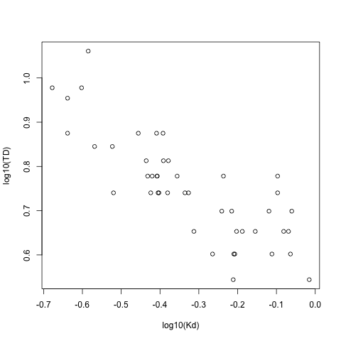

# Re-analysis of the relationship between TD and Kd

## Introduction

This analysis is based on comments by the inland waters editor Vera Istvanovics about the possibility of using a log transformation on the TD ~ Kd analysis.

## Analysis
### Load data

    load("./data/boondoggle")

### Analysis of TD ~ Kd following log-10 transformation

    summary(lm(log10(TD) ~ log10(Kd), data = boon.tot))

#### Output

~~~~
summary(lm(log10(TD) ~ log10(Kd), data = boon.tot))

Call:
lm(formula = log10(TD) ~ log10(Kd), data = boon.tot)

Residuals:
     Min       1Q   Median       3Q      Max 
-0.14546 -0.03939 -0.01064  0.03923  0.17171 

Coefficients:
            Estimate Std. Error t value Pr(>|t|)    
(Intercept)  0.57672    0.02163  26.667  < 2e-16 ***
log10(Kd)   -0.53376    0.05837  -9.144 1.21e-11 ***
---
Signif. codes:  0 ‘***’ 0.001 ‘**’ 0.01 ‘*’ 0.05 ‘.’ 0.1 ‘ ’ 1 

Residual standard error: 0.06893 on 43 degrees of freedom
  (2 observations deleted due to missingness)
Multiple R-squared: 0.6604,	Adjusted R-squared: 0.6525 
F-statistic: 83.62 on 1 and 43 DF,  p-value: 1.213e-11 

~~~~

#### Plot of TD ~ Kd with log10 transformation

    plot(log10(TD) ~ log10(Kd), data = boon.tot)
    dev.copy(png, "./output/logTD_by_logKd_allYrs.png")
    dev.off()

Figure: Relationship between TD and Kd following Log-10 transformation

### Analysis of the TD ~ Kd relationship by year

    summary(lm(log10(TD) ~ log10(Kd), data = boon.tot, subset = Year == 2006))
    summary(lm(log10(TD) ~ log10(Kd), data = boon.tot, subset = Year == 2007))
    summary(lm(log10(TD) ~ log10(Kd), data = boon.tot, subset = Year == 2008))

#### Output

##### 2006

~~~~

summary(lm(log10(TD) ~ log10(Kd), data = boon.tot, subset = Year == 2006))

Call:
lm(formula = log10(TD) ~ log10(Kd), data = boon.tot, subset = Year == 
    2006)

Residuals:
      Min        1Q    Median        3Q       Max 
-0.076670 -0.050513  0.006224  0.025268  0.144190 

Coefficients:
            Estimate Std. Error t value Pr(>|t|)    
(Intercept)  0.68099    0.03311  20.570 7.35e-12 ***
log10(Kd)   -0.40258    0.07175  -5.611 6.42e-05 ***
---
Signif. codes:  0 ‘***’ 0.001 ‘**’ 0.01 ‘*’ 0.05 ‘.’ 0.1 ‘ ’ 1 

Residual standard error: 0.06075 on 14 degrees of freedom
  (2 observations deleted due to missingness)
Multiple R-squared: 0.6922,	Adjusted R-squared: 0.6702 
F-statistic: 31.48 on 1 and 14 DF,  p-value: 6.421e-05 

~~~~

##### 2007

~~~~

summary(lm(log10(TD) ~ log10(Kd), data = boon.tot, subset = Year == 2007))

Call:
lm(formula = log10(TD) ~ log10(Kd), data = boon.tot, subset = Year == 
    2007)

Residuals:
     Min       1Q   Median       3Q      Max 
-0.07523 -0.01941 -0.00118  0.02319  0.09280 

Coefficients:
            Estimate Std. Error t value Pr(>|t|)    
(Intercept)   0.5170     0.1004   5.147 0.000433 ***
log10(Kd)    -0.6763     0.2676  -2.528 0.029977 *  
---
Signif. codes:  0 ‘***’ 0.001 ‘**’ 0.01 ‘*’ 0.05 ‘.’ 0.1 ‘ ’ 1 

Residual standard error: 0.04818 on 10 degrees of freedom
Multiple R-squared: 0.3899,	Adjusted R-squared: 0.3289 
F-statistic:  6.39 on 1 and 10 DF,  p-value: 0.02998 

~~~~

##### 2008

~~~~

summary(lm(log10(TD) ~ log10(Kd), data = boon.tot, subset = Year == 2008))

Call:
lm(formula = log10(TD) ~ log10(Kd), data = boon.tot, subset = Year == 
    2008)

Residuals:
     Min       1Q   Median       3Q      Max 
-0.10331 -0.03557  0.00881  0.02674  0.05510 

Coefficients:
            Estimate Std. Error t value Pr(>|t|)    
(Intercept)  0.57428    0.02189  26.232 6.01e-14 ***
log10(Kd)   -0.34587    0.08687  -3.981   0.0012 ** 
---
Signif. codes:  0 ‘***’ 0.001 ‘**’ 0.01 ‘*’ 0.05 ‘.’ 0.1 ‘ ’ 1 

Residual standard error: 0.04729 on 15 degrees of freedom
Multiple R-squared: 0.5138,	Adjusted R-squared: 0.4814 
F-statistic: 15.85 on 1 and 15 DF,  p-value: 0.001204 

~~~~

### Conclusions

The log transformation does inprove the relationship across all years.  The R2 of the transformed data is 0.65 while the R2 of the untransformed data is 0.52 (not shown).  When the data are analyzed by year the effec is not consistent.  In 2006, the transformation improves the R2 from 0.55 to 0.67.  However in 2007 and 2008 the tranformation reduces the R2 of the relationship from 0.36 to 0.33 and 0.51 to 0.48, respectively.

Overall the changes are modest and suggest that a linear model is appropriate.

